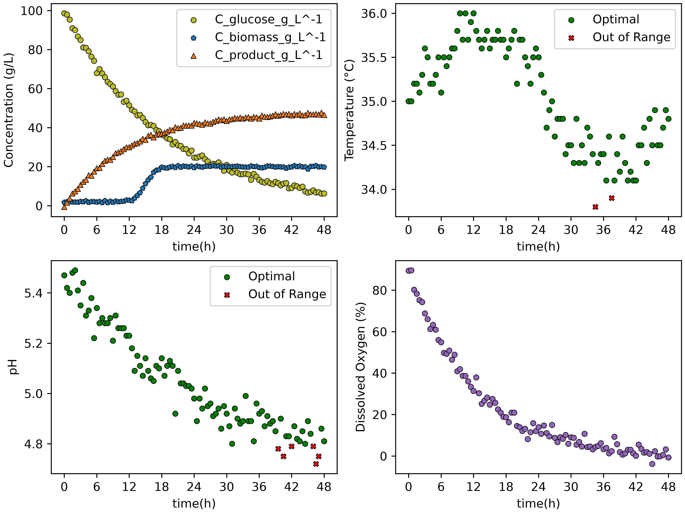

# **Bioprocess Monitoring and Analysis**

We designed a Python tool to process batch fermentation dataset files, evaluate operational boundaries, and export performance summary tables and dashboard visualizations.

## Overview

The goal of this project was to develop an automated utility class (`BioprocessMonitor`) to monitor fermentation bioprocesses. This project parses multi-batch time-series data, evaluates whether critical parameters like pH and temperature remain within specified thresholds, and automatically generates batch-specific visualization dashboards and CSV summary reports.

## Features

* **Data Extraction:** Automatically loads fermentation datasets and extracts data for specific batch identifiers (`extract_batch`).
* **Set Boundaries:** Generates boolean masks to verify whether the pH and temperature measurements stay within defined operational limits (`optimal_ph_mask`, `optimal_temperature_mask`).
* **Batch Analytics:** Calculates the total number of distinct batches (`get_n_batches`) and computes performance metrics per batch.
* **Dashboard Visualization:** Produces a 2×2 subplot dashboard (`export_dashboard`) featuring species concentrations, temperature, pH, and dissolved oxygen percentage over time to analyze the data.
* **Summary Table Export:** Computes operational compliance statistics and exports a CSV summary table (`export_summary`).

## Technologies Used

* **Python** (v3.14)
* **pandas** (v2.2.3) – For data manipulation, batch indexing, boolean mask operations, and CSV summary exports.
* **matplotlib** (v3.10.0) – To create multi-panel dashboard visualization generation and custom styling.

## Code Design

When `main.py` is executed, the script:
1. Imports necessary parameters and initializes the `BioprocessMonitor` class with the target fermentation CSV file path and operational limits.
2. Iterates through all distinct batch IDs in the dataset to generate individual 2×2 dashboard figures and saves them to the `figures/` directory.
3. Calculates overall batch performance metrics and exports the resulting summary dataset to a CSV file in the `tables/` directory.

## Dashboard

### Dashboard Description

The dashboard above displays the time-course fermentation profile for **Batch 1 Mode A**:
* **Top-Left (Concentrations):** Illustrates the consumption of glucose alongside the growth of biomass and accumulation of target product over time.
* **Top-Right (Temperature):** Displays system temperature vs. time. Green circles represent measurements within optimal bounds, while red 'X' markers highlight deviations outside the boundary.
* **Bottom-Left (pH):** Displays culture pH vs. time. Green circles indicate acceptable operating conditions, whereas red 'X' markers pinpoint off-spec operational periods.
* **Bottom-Right (Dissolved Oxygen):** Tracks dissolved oxygen levels (DO%) throughout the course of the batch.
* All subplots feature standardized x-axis tick intervals set at 6-hour increments.

## Summary Table

| batch_id | ph_optimal_percent | temperature_optimal_percent | C_product_g_L^-1_final |
| :---: | :---: | :---: | :---: |
| 1 | 93.81 | 97.94 | 46.5 |
| 2 | 96.69 | 97.52 | 50.8 |
| 3 | 95.89 | 93.15 | 44.6 |
| 4 | 100.0 | 96.47 | 48.6 |
| 5 | 48.62 | 99.08 | 24.7 |

### Summary Table Description

The summary table evaluates key operational performance metrics across all 5 fermentation batches:
* **`batch_id`**: Numerical identifier for each distinct fermentation run.
* **`ph_optimal_percent`**: Percentage of total measurements where pH remained within the acceptable operating range. Batch 4 maintained $100\%$ compliance, whereas Batch 5 experienced significant drift ($48.62\%$).
* **`temperature_optimal_percent`**: Percentage of measurements where temperature remained within specified boundaries (ranging from $93.15\%$ to $99.08\%$).
* **`C_product_g_L^-1_final`**: Final product yield concentration ($g/L$) recorded at the conclusion of each batch run.
